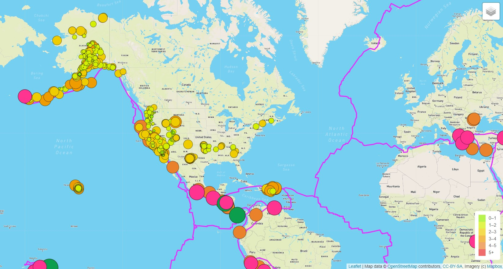

# Mapping_Earthquakes

## Overview 
The purpose of this project was to visually show the differences between the magnitudes of earthquakes all over the world for the last seven days.  

In this challenge, I used URLs for GeoJSON earthquake data from the USGS website retrieve geographical coordinates and the magnitudes of earthquakes for the last seven days. JavaScript, HTML, the D3.js library, and css were all  used to create an interactive webpage with overlays that showed the last seven days of earthquake data, the tectonic plates, and also the "major" earthquake data with magnitudes greater than 5.

